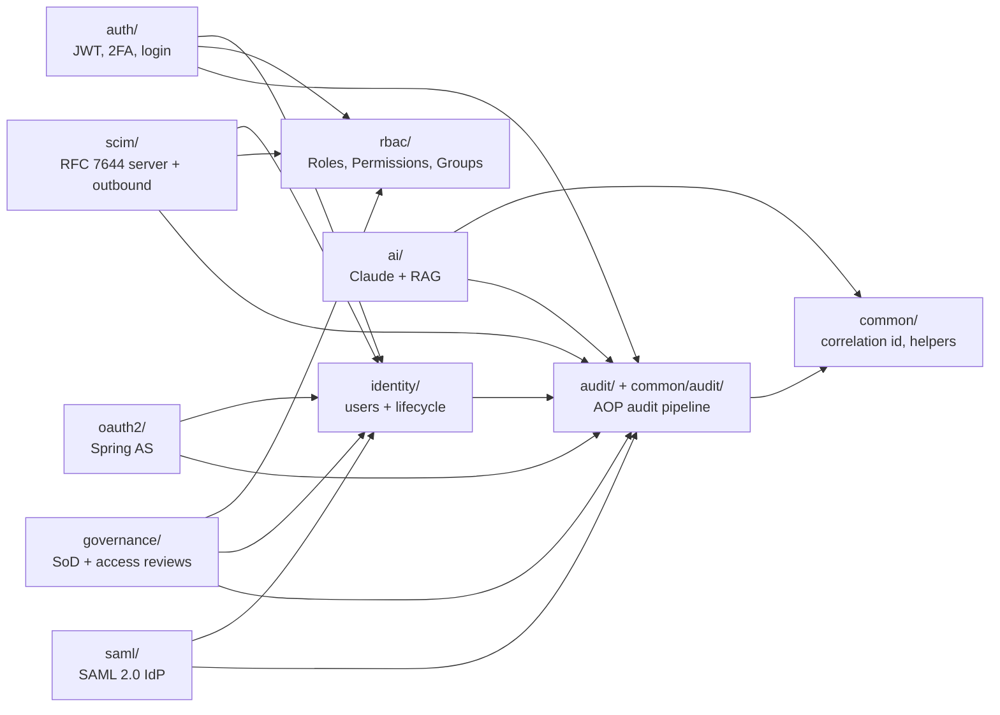
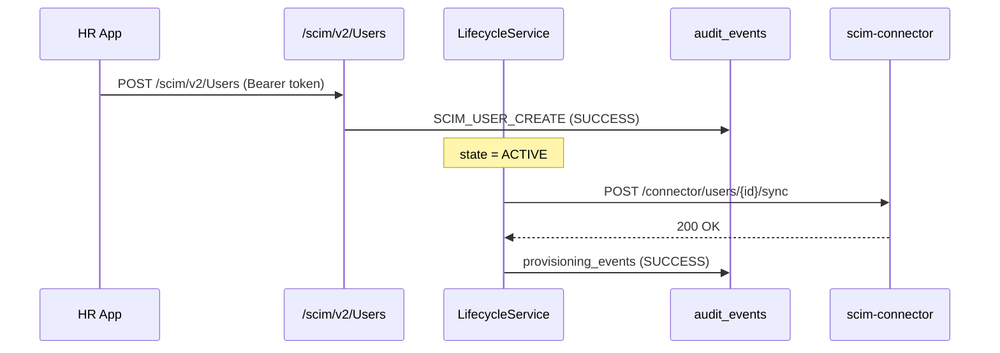
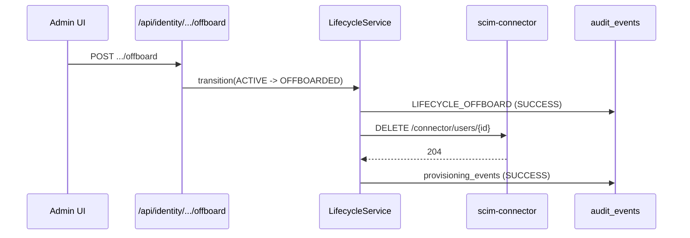
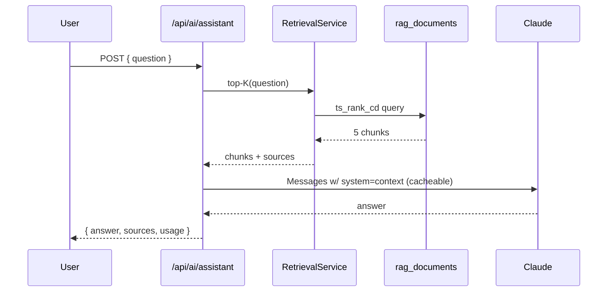

# Architecture

This doc explains *why* the codebase is shaped the way it is, not
just *what* it contains. For a feature tour, see the
[README](../README.md).

## Bounded contexts

The Java side is split into one package per IAM domain so each context
owns its model, repository, service and controller — additions land
sideways instead of bloating shared layers.

## End-to-end flows

### Joiner (new hire)

### Leaver (offboarding)

### IAM Assistant (RAG)

## Persistence

PostgreSQL 16 with Flyway. Every schema change is a numbered SQL file
under `src/main/resources/db/migration/`:

| Version | Adds                              |
| ------- | --------------------------------- |
| V1      | `users` baseline                   |
| V2      | lifecycle columns, manager FK      |
| V3-V4   | RBAC schema + seed roles           |
| V5      | `audit_events` immutable log       |
| V6      | Spring Authorization Server tables |
| V7      | demo OAuth2 client seed            |
| V8      | `saml_service_providers`           |
| V9      | `provisioning_events`              |
| V10     | `rag_documents` + tsvector index   |
| V11     | governance: SoD + access reviews   |

JPA runs with `ddl-auto=validate` — Hibernate refuses to start if
the schema and the entities ever drift.

## Security model

- **Authentication**: legacy `/api/auth/login` returns a JJWT bearer;
  Spring Authorization Server issues RS256 JWTs at `/oauth2/token`.
  Both are accepted on every API endpoint by chaining
  `JwtAuthenticationFilter` (legacy) + `oauth2ResourceServer.jwt()`.
- **Authorization**: `CustomUserDetailsService` resolves effective
  authorities = role names + permission names from active direct
  `RoleAssignment`s + group-mediated grants. Endpoints declare
  required authorities with `hasAnyAuthority(...)` in `SecurityConfig`.
- **Audit**: `@Auditable` AOP wraps every security-relevant method;
  `CorrelationIdFilter` stamps each request so audit + structured
  logs share an id.
- **SoD**: `SodCheckJob` (every 30 min) flags any user holding both
  roles of an enabled rule; violations are recorded in `sod_violations`.

## Observability

- `/actuator/health` (+ liveness/readiness probes) for k8s/docker.
- `/actuator/prometheus` for scrape pipelines.
- `logback-spring.xml` flips to LogstashEncoder JSON when the `docker`
  profile is active so log shippers (ELK / Loki / CloudWatch) parse
  correlation_id + custom fields directly.

## Trade-offs / known limits

- **SAML IdP** is hand-rolled around JDK XMLDSig — keeps the dep tree
  small but only supports HTTP-POST + HTTP-Redirect bindings, no SLO,
  no AuthnRequest signature verification yet.
- **RAG retrieval** uses Postgres tsvector instead of pgvector to avoid
  loading an extension on commodity Postgres images. Lexical scoring is
  weaker than semantic; the `RetrievalService` API hides the difference
  so swapping in pgvector is a one-file change.
- **JWKS / SAML signing keys** are generated in-memory at boot — fine
  for portfolio / dev. Production should bind-mount a keystore so the
  trust chain stays valid across restarts.
- Frontend is intentionally vanilla HTML/CSS/JS — focus stays on the
  backend IAM surface.
